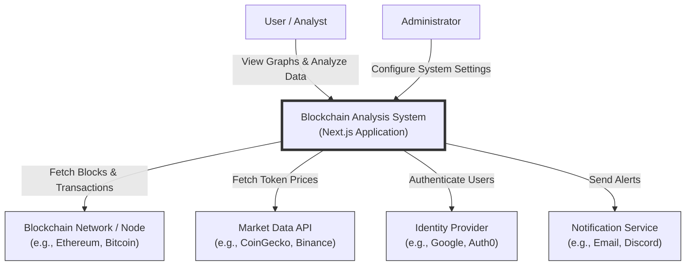
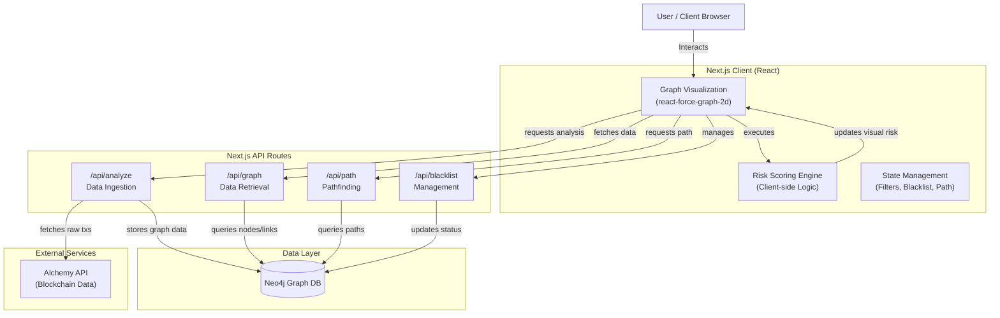
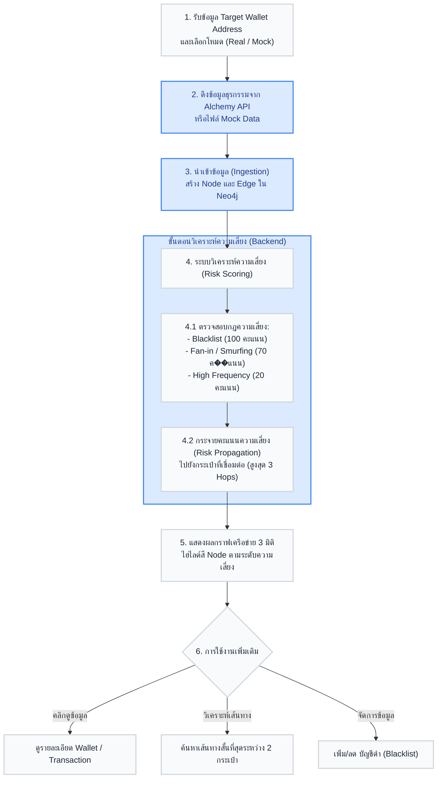

# README

... (existing content) ...

## Diagrams (Mermaid)

[Context Diagram](mmd/context-diagram.mmd)


[Dataflow Diagram](mmd/dataflow.mmd)


[Flowchart](mmd/flowchart.mmd)


[Graph Database Model](mmd/graph-database.mmd)
```mermaid
graph LR
    W1(("Wallet <br/>address: '0xAAA...'")) ) -- "[:SENT_TO]" --> T1{{"Transaction <br/>txHash: '0x123...'<br/>value: 2.5<br/>timestamp: 1698..."}}
    W2(("Wallet <br/>address: '0xBBB...'")) ) -- "[:RECEIVED_FROM]" --> T1
    W3(("Wallet <br/>address: '0xCCC...'")) ) -- "[:RECEIVED_FROM]" --> T1
    
    style W1 fill:#3b82f6,color:#fff,stroke:#1d4ed8,stroke-width:2px
    style W2 fill:#3b82f6,color:#fff,stroke:#1d4ed8,stroke-width:2px
    style W3 fill:#3b82f6,color:#fff,stroke:#1d4ed8,stroke-width:2px
    style T1 fill:#f59e0b,color:#fff,stroke:#d97706,stroke-width:2px
```