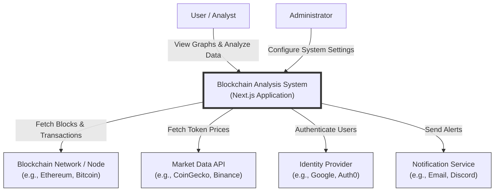
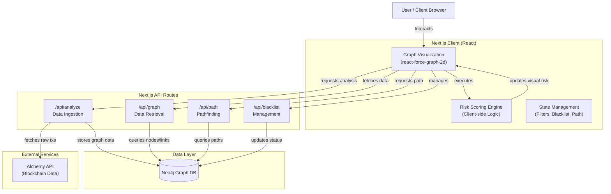
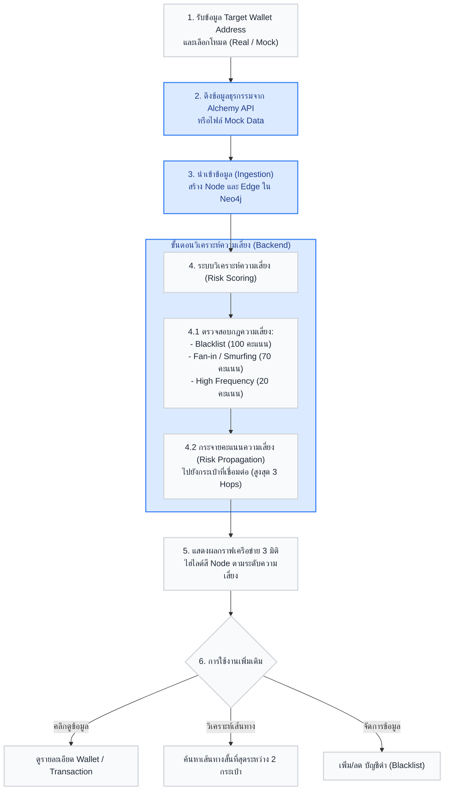
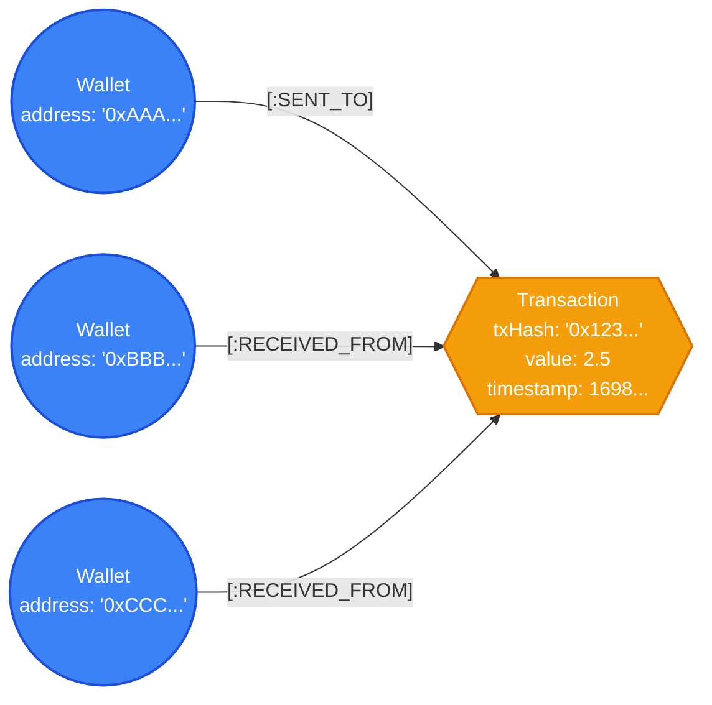

# BlockchainAnalysis

โปรเจกต์วิเคราะห์เส้นทางธุรกรรมบนบล็อกเชน โดยใช้
- Next.js + TypeScript สำหรับเว็บแอป
- Neo4j สำหรับจัดเก็บและวิเคราะห์ความสัมพันธ์แบบกราฟ
- Alchemy API สำหรับดึงข้อมูลธุรกรรม

## ความสามารถหลัก

- วิเคราะห์ความเสี่ยงของที่อยู่กระเป๋าเงิน
- ค้นหาเส้นทางธุรกรรม (Path/Graph) ระหว่าง Address
- จัดการรายการ Blacklist / Exempt ผ่าน API
- แสดงผลกราฟธุรกรรมบนหน้าเว็บ

## ความต้องการระบบ

ใช้งานตามเอกสาร [SYSTEM_REQUIREMENTS.md](SYSTEM_REQUIREMENTS.md)

ขั้นต่ำแนะนำ:
- Node.js 18+
- npm 9+
- Docker Desktop (ถ้าจะรันแบบ Container)

## การเตรียมค่า Environment

1. สร้างไฟล์ `.env` ที่ root ของโปรเจกต์
2. คัดลอกค่าจากไฟล์ `env.template` ลงใน `.env`
3. แก้ค่าให้เป็นของคุณเอง

ตัวอย่างคำสั่ง:

```bash
cp env.template .env
```

สำหรับ Windows PowerShell:

```powershell
Copy-Item env.template .env
```

ตัวแปรสำคัญ:

- `ALCHEMY_API_URL` : URL ของ Alchemy API
- `NEO4J_URI` : URI สำหรับเชื่อมต่อ Neo4j
- `NEO4J_USERNAME` : ชื่อผู้ใช้ Neo4j
- `NEO4J_PASSWORD` : รหัสผ่าน Neo4j
- `NEO4J_DATABASE` : ชื่อฐานข้อมูล (ปกติคือ `neo4j`)

## วิธีรันโปรแกรม (Local)

### 1) ติดตั้ง Dependencies

```bash
npm install
```

### 2) รันโหมดพัฒนา

```bash
npm run dev
```

### 3) เปิดเว็บ

ไปที่ `http://localhost:3000`

## วิธีรันโปรแกรมด้วย Docker Compose

ในโหมดนี้จะรันทั้ง Web และ Neo4j พร้อมกัน

### 1) ตรวจสอบไฟล์ `.env`

ต้องมีค่า `NEO4J_PASSWORD` และตัวแปรอื่นที่จำเป็นครบ

### 2) Build และ Start

```bash
docker compose up --build -d
```

### 3) ตรวจสอบ Service

```bash
docker compose ps
```

### 4) เข้าใช้งาน

- Web App: `http://localhost:3000`
- Neo4j Browser: `http://localhost:7474`

### 5) หยุดการทำงาน

```bash
docker compose down
```

## คำสั่งที่ใช้บ่อย

```bash
npm run dev      # รันโหมดพัฒนา
npm run build    # สร้าง production build
npm run start    # รัน production server
npm run lint     # ตรวจ lint
```

## โครงสร้างโปรเจกต์แบบย่อ

```text
app/
	api/
		analyze/
		blacklist/
		exempt/
		graph/
		path/
graph/
utils/
public/
docker-compose.yml
Dockerfile
env.template
```

## Diagrams (Mermaid)

> GitHub จะแสดง Mermaid จากใน README โดยตรง (โค้ดบล็อก ```mermaid) ด้านล่างนี้คือไดอะแกรมหลักที่อยู่ในโฟลเดอร์ `mmd/`

### 1) Context Diagram

ไฟล์: `mmd/context-diagram.mmd`



### 2) Dataflow Diagram

ไฟล์: `mmd/dataflow.mmd`



### 3) Flowchart

ไฟล์: `mmd/flowchart.mmd`



### 4) Graph Database Model

ไฟล์: `mmd/graph-database.mmd`



## หมายเหตุด้านความปลอดภัย

- ไฟล์ `.env` ถูกตั้งค่าใน `.gitignore` แล้ว และไม่ควรถูก commit ขึ้น Git
- ห้ามใส่ API Key หรือรหัสผ่านจริงใน README
- หากเคยเผลอเผยแพร่ข้อมูลลับ ให้รีบเปลี่ยน (rotate) คีย์/รหัสผ่านทันที

## ปัญหาที่พบบ่อย

### 1) ต่อ Neo4j ไม่ได้
- ตรวจค่า `NEO4J_URI`, `NEO4J_USERNAME`, `NEO4J_PASSWORD`
- ถ้ารันผ่าน Docker Compose ให้ใช้ host ตาม service ที่กำหนดในไฟล์ compose

### 2) เปิดเว็บไม่ได้ที่พอร์ต 3000
- ตรวจว่ามีโปรแกรมอื่นใช้พอร์ต 3000 อยู่หรือไม่
- เช็กสถานะ container ด้วย `docker compose ps`

### 3) Build ไม่ผ่าน
- ลบโฟลเดอร์ `node_modules` และติดตั้งใหม่
- ใช้ Node.js เวอร์ชันที่รองรับ (แนะนำ 18+)